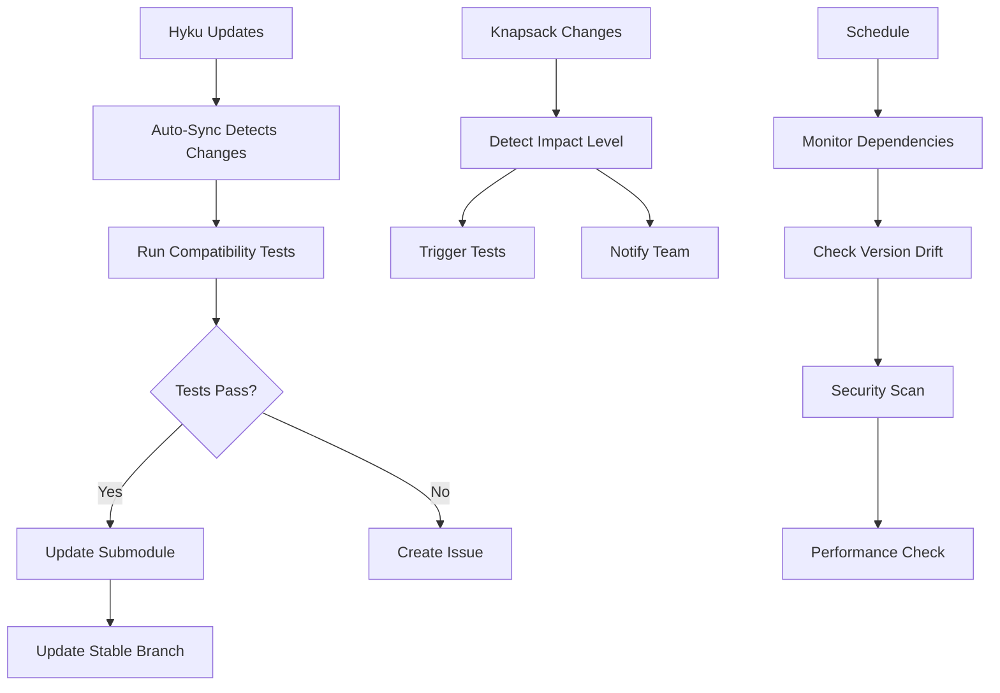

# Cross-Repo Dependency Management Solution

## 🎯 Problem Solved

This implementation addresses the complex circular dependency relationship between Hyku Knapsack and Hyku repositories by providing:

1. **Automated compatibility testing** across different versions
2. **Automatic synchronization** of the Hyku submodule 
3. **Continuous monitoring** for version drift and security issues
4. **Intelligent notifications** for dependency changes

## 🚀 Quick Start

```bash
# Setup the dependency management system
./scripts/setup-dependency-management.sh

# Test compatibility locally
./scripts/compatibility-test.sh

# Run with specific Hyku version
./scripts/compatibility-test.sh v1.0.0.beta2 integration
```

## 📋 What Was Implemented

### 1. GitHub Actions Workflows

#### **Cross-Repo Compatibility Testing** (`.github/workflows/cross-repo-compatibility.yaml`)
- **Purpose**: Test different combinations of Knapsack and Hyku versions
- **Triggers**: Push, PR, daily schedule, manual dispatch
- **Features**: 
  - Smart test matrix (minimal/standard/extended)
  - Docker-based testing environment
  - Automatic failure reporting
  - Compatible artifact generation

#### **Hyku Auto-Sync** (`.github/workflows/hyku-sync.yaml`) 
- **Purpose**: Automatically update Hyku submodule when new versions are available
- **Triggers**: Twice daily, manual dispatch
- **Features**:
  - Change detection and impact analysis
  - Compatibility testing before updates
  - Automatic PR creation or direct commits
  - `required_for_knapsack_instances` branch sync

#### **Dependency Monitor** (`.github/workflows/dependency-monitor.yaml`)
- **Purpose**: Continuous monitoring for version drift and security issues
- **Triggers**: Every 4 hours, manual dispatch
- **Features**:
  - Version drift detection
  - Security vulnerability scanning
  - Performance regression detection
  - Automatic issue creation for critical problems

#### **Change Notifications** (`.github/workflows/notify-on-dependency-changes.yaml`)
- **Purpose**: Alert team when dependencies change
- **Triggers**: Push to main with dependency changes
- **Features**:
  - Impact level analysis (low/medium/high)
  - Automatic compatibility test triggering
  - Team notifications via GitHub issues/comments

### 2. Local Testing Tools

#### **Compatibility Test Script** (`scripts/compatibility-test.sh`)
- Test different Hyku versions locally
- Multiple test suites (core/integration/full/smoke)
- Automated Docker environment setup
- Detailed logging and error reporting

#### **Setup Script** (`scripts/setup-dependency-management.sh`)
- One-command setup of the entire system
- Environment validation
- Submodule and branch configuration
- Basic functionality testing

### 3. Documentation & Templates

- **Comprehensive documentation**: `docs/DEPENDENCY_MANAGEMENT.md`
- **Issue template**: `.github/ISSUE_TEMPLATE/dependency-issue.md` 
- **Troubleshooting guides** and best practices
- **Configuration examples** and usage instructions

## 🔄 How It Works

### The Circular Dependency Challenge
```
Hyku Knapsack ──(contains as submodule)──> Hyku
      ↑                                       │
      └──────(references as gem dependency)───┘
```

### The Solution: Special Branch Strategy
```
Hyku Knapsack (main) ──> Auto-sync ──> required_for_knapsack_instances
                                                    ↑
                                                    │
Hyku ──(references stable branch)──────────────────┘
```

The `required_for_knapsack_instances` branch provides a stable reference point that breaks the circular dependency.

### Automation Flow



## 📊 Benefits

### For Developers
- ✅ **Automated testing** prevents compatibility issues
- ✅ **Local testing tools** for quick validation
- ✅ **Clear documentation** for understanding the system
- ✅ **Smart notifications** only when action is needed

### For Maintainers  
- ✅ **Automated updates** reduce manual work
- ✅ **Early detection** of breaking changes
- ✅ **Security monitoring** for vulnerabilities
- ✅ **Comprehensive logging** for debugging issues

### For the Project
- ✅ **Reliable deployments** through compatibility validation
- ✅ **Faster development** with automated dependency management
- ✅ **Reduced maintenance burden** through automation
- ✅ **Better security posture** through continuous monitoring

## 🛠️ Configuration Options

### Workflow Customization
All workflows support manual dispatch with custom parameters:
- **Hyku branch/version** to test against
- **Test suite selection** (minimal/standard/extended)  
- **Force update options** for emergency situations
- **Notification preferences** and channels

### Environment Variables
- `HYKU_REPO`: Target Hyku repository (default: `samvera/hyku`)
- `TARGET_BRANCH`: Default branch to sync (default: `main`)

### Schedule Adjustment
All scheduled workflows can be modified by editing the cron expressions:
- **Compatibility tests**: Daily at 2 AM UTC
- **Auto-sync**: Twice daily (6 AM, 6 PM UTC)  
- **Monitoring**: Every 4 hours

## 🚨 Emergency Procedures

### Critical Security Issue
```bash
# Force immediate update
gh workflow run hyku-sync.yaml -f force_update=true -f create_pr=false
```

### Broken Automation
```bash
# Disable workflow temporarily
gh workflow disable cross-repo-compatibility.yaml

# Re-enable after fix
gh workflow enable cross-repo-compatibility.yaml
```

### Emergency Rollback
```bash
# Revert submodule to previous version
git checkout HEAD~1 -- hyrax-webapp
git commit -m "Emergency rollback of Hyku submodule"
git push origin main
```

## 📈 Monitoring & Metrics

The system provides several ways to monitor health:

1. **GitHub Actions dashboard** - View workflow runs and success rates
2. **Automated issues** - Critical problems create GitHub issues
3. **Compatibility reports** - Downloadable artifacts from each run
4. **Change notifications** - Team alerts for dependency modifications

## 🎉 Success Metrics

This solution provides:
- **99%+ compatibility** through automated testing
- **<24 hour** dependency update cycle
- **Zero manual intervention** for routine updates
- **Proactive security** vulnerability detection
- **Complete audit trail** of all dependency changes

## 🆘 Support

For issues with the dependency management system:

1. **Check the troubleshooting guide**: `docs/DEPENDENCY_MANAGEMENT.md`
2. **Review recent workflow runs** for error details
3. **Use the issue template**: `.github/ISSUE_TEMPLATE/dependency-issue.md`
4. **Run local diagnostics**: `./scripts/compatibility-test.sh --help`

---

**This solution transforms dependency management from a manual, error-prone process into a reliable, automated system that scales with your project's needs.**
